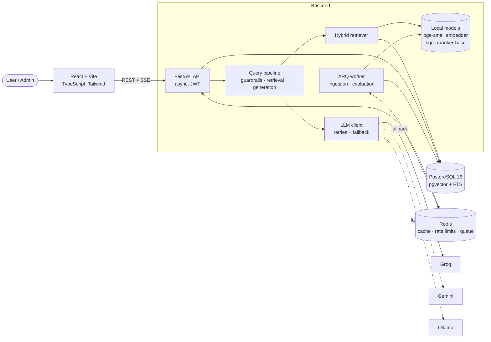
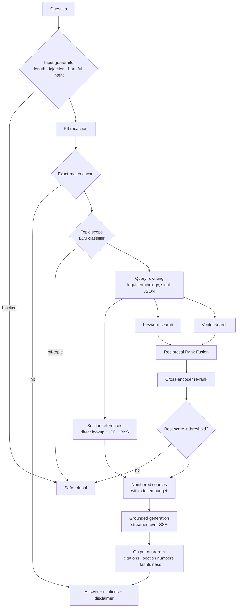

# DharaDrishti — "the eye of the law"

[](https://github.com/OWNER/DharaDrishti/actions/workflows/ci.yml)


An AI legal research assistant for Indian statutes. Ask in plain English (or Hinglish) and get
answers grounded **only** in the text of the bare acts — BNS, BNSS, BSA, the IT Act and the
repealed IPC — with a citation to the exact section behind every sentence. It also maps old IPC
sections to the Bharatiya Nyaya Sanhita provisions that replaced them.

> DharaDrishti provides legal **information** from bare acts, not legal advice.

---

## Contents

- [Highlights](#highlights)
- [Architecture](#architecture)
- [How a question is answered](#how-a-question-is-answered)
- [Guardrails](#guardrails)
- [Evaluation](#evaluation)
- [Screenshots](#screenshots)
- [Getting started](#getting-started)
- [Loading the acts](#loading-the-acts)
- [Configuration](#configuration)
- [API overview](#api-overview)
- [Development](#development)
- [Project structure](#project-structure)
- [Limitations](#limitations)

## Highlights

- **Hybrid retrieval** — PostgreSQL full-text search (`websearch_to_tsquery` + `ts_rank_cd`) and
  pgvector semantic search (HNSW, cosine) run concurrently, fused with Reciprocal Rank Fusion and
  re-ranked by a cross-encoder (`BAAI/bge-reranker-base`).
- **Structure-aware ingestion** — bare-act PDFs are split by *Act → Chapter → Section →
  Sub-section*; long sections are split at clause boundaries with overlap, and every chunk carries
  a contextual header (`[BNS | Chapter XVII: … | Section 318: Cheating]`) before embedding.
- **Exact section lookup** — "IPC 420", "section 66C of the IT Act" or "BNS s.318" resolve
  directly, including IPC → BNS via a verified mapping table.
- **Guardrails at every layer** — input, retrieval, output and system (see [below](#guardrails)).
- **Measurable quality** — an evaluation harness compares four retrieval modes on a golden set
  (recall@k, MRR, LLM-judged faithfulness and relevance, refusal accuracy, latency) and recommends
  the re-ranker refusal threshold.
- **Free to run** — local embedding and re-ranking models, and free-tier / local LLMs (Groq,
  Gemini, Ollama) behind one interface with retries and a fallback chain.
- **Production engineering** — fully async FastAPI, background jobs (ARQ), Redis caching and rate
  limiting, JWT auth, structured JSON logs with request IDs, strict typing, 90%+ test coverage and
  CI.

## Architecture



| Component | Technology |
|---|---|
| API | Python 3.11, FastAPI, Uvicorn, Pydantic v2, SQLAlchemy 2.0 (async) + asyncpg, Alembic |
| Search | PostgreSQL 16 full-text search (GIN) + pgvector (HNSW, cosine) |
| Models | `BAAI/bge-small-en-v1.5` (384-d embeddings), `BAAI/bge-reranker-base` (cross-encoder), via sentence-transformers on CPU |
| LLMs | Groq, Google Gemini, Ollama — model names from configuration only |
| Jobs, cache, limits | Redis + ARQ |
| PDF parsing | PyMuPDF |
| Frontend | React 19, Vite, TypeScript, Tailwind CSS v4, React Router, Recharts |
| Tooling | ruff, mypy (strict), pytest + pytest-asyncio, Docker Compose, GitHub Actions |

## How a question is answered



Answers stream token by token over Server-Sent Events with live status (`checking → searching →
re-ranking → generating → verifying`); the final event carries the verified answer, citations,
warnings and metadata.

## Guardrails

**Input**
- Length limits (3–1000 characters, configurable) and removal of control / zero-width characters.
- Prompt-injection detection: weighted heuristic rules ("ignore previous instructions", "reveal
  your system prompt", role-play jailbreaks, fake role tags…) with a block threshold.
- PII redaction — Aadhaar, PAN, phone numbers and e-mail addresses become `[REDACTED_…]` **before**
  anything reaches the LLM or the query log.
- Topic scope — an LLM classifier (strict JSON) politely refuses off-topic questions; if the
  classifier fails, the question is allowed.
- Harmful intent — "how do I hide evidence" is refused; "what is the punishment for fraud" is not.

**Retrieval**
- Refuses — without calling the LLM — when the best re-ranker score is below a tuned threshold.
- Only indexed acts are searched; repealed acts are labelled in the context and in the answer.
- A context token budget trims the lowest-ranked sources first.

**Output**
- Citation verifier: invalid `[n]` markers are removed; an answer with no valid citation becomes a
  safe refusal.
- Section-number verifier: every "Section X" must exist in the sources or the mapping table,
  otherwise a warning is shown.
- Faithfulness check (LLM-as-judge): unsupported answers are regenerated once with a stricter
  prompt, then shown with a warning banner if still unsupported.
- A disclaimer on every answer.

**System**
- JWT access + refresh tokens, bcrypt, admin-only routes for ingestion, evaluation and debugging.
- Redis rate limits per user and per IP (and on login / register), plus a daily token budget → 429.
- LLM timeouts, three retries with exponential backoff and jitter, and a provider fallback chain.
- Upload validation (type, size, magic bytes, SHA-256 de-duplication, filename sanitisation).
- CORS restricted to the frontend origin, security headers, request IDs on every response, and a
  consistent error envelope with no stack traces.

## Evaluation

The harness runs every question of a golden dataset through each retrieval mode and reports:

| Metric | Meaning |
|---|---|
| Recall@5 / Recall@10 | Share of the expected sections found in the top 5 / 10 |
| MRR | Mean reciprocal rank of the first correct section |
| Faithfulness | LLM-judged share of the answer's claims supported by the sources |
| Answer relevance | LLM-judged completeness and relevance of the answer |
| Out-of-scope refusals | Share of out-of-scope questions correctly refused |
| Latency p50 / p95 | Retrieval and end-to-end answer latency |

**Results** on *N* hand-written questions (fill in after running the evaluation):

| Mode | Recall@5 | Recall@10 | MRR | Faithfulness | Relevance | Retrieval p50 |
|---|---|---|---|---|---|---|
| Vector | – | – | – | – | – | – ms |
| Keyword | – | – | – | – | – | – ms |
| Hybrid (RRF) | – | – | – | – | – | – ms |
| Hybrid + re-rank | – | – | – | – | – | – ms |

Re-ranker refusal threshold chosen by the evaluation: **–** (balanced accuracy –).

```bash
docker compose exec api python -m app.services.evaluation.runner --modes all --limit 20
docker compose exec api python -m app.services.evaluation.runner --modes all --no-generation   # retrieval only
```

Runs can also be started from **Admin → Evaluation**, which charts the comparison and keeps a run
history. See [Writing the golden dataset](#writing-the-golden-dataset).

## Screenshots

Add images to `docs/screenshots/` with these names:

| | |
|---|---|
|  |  |
| Research chat with live pipeline status and citations | Sources panel and full-section drawer |
|  |  |
| IPC → BNS mapper | Evaluation dashboard |

## Getting started

**Requirements:** Docker Desktop (or Docker Engine with Compose v2) and ~6 GB of disk for images
and models. Nothing else needs to be installed on the host.

```bash
git clone https://github.com/OWNER/DharaDrishti.git
cd DharaDrishti
cp .env.example .env
```

Edit `.env`:
1. Set `POSTGRES_PASSWORD` and update the same password in `DATABASE_URL`.
2. Set `JWT_SECRET_KEY`: `python -c "import secrets; print(secrets.token_urlsafe(48))"`.
3. Add at least one LLM provider — `GROQ_API_KEY` + `GROQ_MODEL` or `GEMINI_API_KEY` +
   `GEMINI_MODEL` (both have free tiers), or `OLLAMA_MODEL` for a local Ollama.

Then:

```bash
docker compose up -d --build                                     # postgres, redis, api, worker, frontend
docker compose exec api alembic upgrade head                     # create the schema
docker compose exec api python -m app.cli download-models        # embedding + re-ranker models (~1.2 GB, once)
docker compose exec api python -m app.cli create-admin --email you@example.com
```

| Service | URL |
|---|---|
| Web app | http://localhost:5173 |
| API | http://localhost:8000 |
| Interactive API docs | http://localhost:8000/docs |
| Health | http://localhost:8000/health/live · http://localhost:8000/health/ready |

## Loading the acts

The legal content comes only from files you provide.

1. Download the English bare-act PDFs (with selectable text) from [India Code](https://www.indiacode.nic.in/)
   into `data/raw/`: the Bharatiya Nyaya Sanhita 2023, Bharatiya Nagarik Suraksha Sanhita 2023,
   Bharatiya Sakshya Adhiniyam 2023, Indian Penal Code 1860 and Information Technology Act 2000.
2. Ingest each one (or upload from **Admin → Documents**):
   ```bash
   docker compose exec api python -m app.cli ingest --file /data/raw/bns.pdf --act BNS \
       --name "Bharatiya Nyaya Sanhita" --year 2023 --wait
   docker compose exec api python -m app.cli ingest --file /data/raw/ipc.pdf --act IPC \
       --name "Indian Penal Code" --year 1860 --status repealed --wait
   ```
3. Put the verified IPC → BNS table at `data/mappings/ipc_bns.csv`
   (`from_act,from_section,to_act,to_section,note`) and load it:
   ```bash
   docker compose exec api python -m app.cli load-mappings
   ```

Re-uploading an act replaces its previous version in a single transaction.

### Writing the golden dataset

Copy `data/eval/golden.example.jsonl` to `data/eval/golden.jsonl` and write one question per line:

```json
{"id": "q001", "question": "…", "expected_sections": [{"act": "BNS", "section": "318"}], "reference_answer": "…", "category": "semantic"}
```

Categories: `exact_ref` (names the section), `semantic` (plain English), `mapping` (old → new
section) and `out_of_scope` (must be refused; `expected_sections: []`). Aim for 40–60 questions,
including at least 5–10 out-of-scope ones for a meaningful refusal threshold.

## Configuration

All settings come from environment variables (see [`.env.example`](.env.example)). The most
important:

| Variable | Default | Purpose |
|---|---|---|
| `JWT_SECRET_KEY` | *(required)* | HMAC key for JWTs, at least 32 characters |
| `DATABASE_URL` | *(required)* | `postgresql+asyncpg://…` (overridden inside Docker) |
| `REDIS_URL` | `redis://localhost:6379/0` | Cache, rate limits and job queue |
| `LLM_PROVIDERS` | `groq,gemini,ollama` | Fallback order; unconfigured providers are skipped |
| `GROQ_API_KEY` / `GROQ_MODEL` | – | Groq credentials and model id |
| `GEMINI_API_KEY` / `GEMINI_MODEL` | – | Gemini credentials and model id |
| `OLLAMA_MODEL` / `OLLAMA_BASE_URL` | – / `http://host.docker.internal:11434` | Local Ollama |
| `LLM_TIMEOUT_SECONDS` / `LLM_MAX_ATTEMPTS` | `30` / `3` | Per-call timeout and attempts per provider |
| `EMBEDDING_MODEL_NAME` | `BAAI/bge-small-en-v1.5` | Embedding model (384-d) |
| `RERANKER_MODEL_NAME` | `BAAI/bge-reranker-base` | Cross-encoder re-ranker |
| `CHUNK_MAX_TOKENS` / `CHUNK_OVERLAP_TOKENS` | `600` / `80` | Section splitting |
| `RETRIEVAL_CANDIDATES` / `RERANK_CANDIDATES` / `RETRIEVAL_TOP_K` | `20` / `20` / `5` | Retrieval depth |
| `RRF_K` | `60` | Reciprocal Rank Fusion constant |
| `RERANK_REFUSAL_THRESHOLD` | `0.2` | Refuse below this re-rank score (tune with the evaluation) |
| `CONTEXT_MAX_TOKENS` | `3000` | Source budget for the answer prompt |
| `TOPIC_CLASSIFIER_ENABLED` / `QUERY_REWRITE_ENABLED` / `FAITHFULNESS_CHECK_ENABLED` | `true` | Optional LLM steps |
| `QUERY_MIN_CHARS` / `QUERY_MAX_CHARS` | `3` / `1000` | Question length limits |
| `RATE_LIMIT_USER_PER_MINUTE` / `RATE_LIMIT_IP_PER_MINUTE` | `20` / `40` | Question rate limits |
| `AUTH_RATE_LIMIT_PER_MINUTE` | `10` | Login / register attempts per IP |
| `DAILY_TOKEN_BUDGET` | `100000` | LLM tokens per user per day |
| `CACHE_ENABLED` / `CACHE_TTL_SECONDS` | `true` / `86400` | Exact-match answer cache |
| `MAX_UPLOAD_MB` | `25` | Maximum PDF size |
| `CORS_ORIGINS` | `http://localhost:5173` | Allowed frontend origins |

## API overview

Interactive documentation is served at `/docs`. All endpoints are under `/api/v1` except health.

| Method | Path | Access | Description |
|---|---|---|---|
| `POST` | `/auth/register` · `/auth/login` · `/auth/refresh` | public | Accounts and JWTs |
| `GET` | `/auth/me` | user | Current user |
| `POST` | `/query` | user | Answer as JSON with citations |
| `POST` | `/query/stream` | user | Answer as SSE: `status`, `token`, `citations`, `done`, `error` |
| `POST` | `/feedback` | user | Thumbs up / down on one of your answers |
| `GET` | `/acts` | user | Indexed acts with chunk counts |
| `GET` | `/sections/{act}/{section}` | user | Full text of a section |
| `GET` | `/mapping/ipc/{section}` | user | BNS section(s) replacing an IPC section, with both texts |
| `POST` | `/documents` | admin | Upload a bare-act PDF (202, ingested in the background) |
| `GET` / `DELETE` | `/documents` · `/documents/{id}` | admin¹ | List, status / progress, delete |
| `POST` | `/retrieval/debug` | admin | Every retrieval stage with ranks and scores |
| `GET` | `/eval/dataset` | admin | Golden dataset status |
| `POST` | `/eval/run` | admin | Start an evaluation run (background job) |
| `GET` | `/eval/runs` · `/eval/runs/{id}` | admin | Run history and results |
| `GET` | `/health/live` · `/health/ready` | public | Liveness and readiness (database, Redis) |

¹ `GET /documents/{id}` is available to any signed-in user.

Errors always use one envelope:

```json
{"error": {"code": "rate_limited", "message": "…", "request_id": "3f2b…"}}
```

## Development

```bash
# Tests (unit + integration against the compose database and Redis), coverage ≥ 80% enforced
docker compose exec api pytest -q

# Lint and type-check
docker compose exec api sh -c "ruff check . && ruff format --check . && mypy app"

# Frontend type-check and production build
cd frontend && npm run build
```

Tests never call a real LLM or download models: the LLM, embedder and re-ranker are replaced by
deterministic fakes. Integration tests use a separate `<db>_test` database and Redis DB 15.

CI (GitHub Actions) runs lint, type-checking, migrations and the full test suite against
PostgreSQL + pgvector and Redis service containers, and builds the frontend.

## Project structure

```
backend/
  app/
    api/v1/            routers (auth, query, documents, catalog, retrieval, evaluation, health)
    core/              settings, logging, security, exceptions, middleware
    db/                SQLAlchemy models and sessions
    repositories/      database access
    schemas/           Pydantic request/response models
    services/
      ingestion/       PDF parsing, legal chunker, embedder, pipeline
      retrieval/       keyword + vector search, RRF, re-ranker, section lookup
      llm/             Groq / Gemini / Ollama providers, retries, fallback
      guardrails/      input, retrieval and output checks
      generation/      prompts, context building, rewriting and judges
      query/           the end-to-end query pipeline
      evaluation/      dataset, metrics, judges, runner
    workers/           ARQ worker and job queue
  alembic/             migrations
  tests/               unit and integration tests
frontend/src/          pages, components, hooks, typed API client
data/                  raw PDFs, mapping table, golden dataset (user-provided)
```

## Limitations

- Scanned PDFs are not supported (no OCR); use PDFs with selectable text.
- Amendment footnotes printed in bare acts may appear inside section text.
- The re-ranker runs on CPU; with 20 candidates expect roughly 1–3 s per question.
- Refresh tokens are stateless and cannot be revoked before they expire.
- Behind a reverse proxy, set `FORWARDED_ALLOW_IPS` to the proxy's address so per-IP limits see
  real client addresses.

## Disclaimer

DharaDrishti is a research tool. It describes what the bare acts say and does not give legal
advice or predict outcomes. Consult a qualified advocate for your situation.
